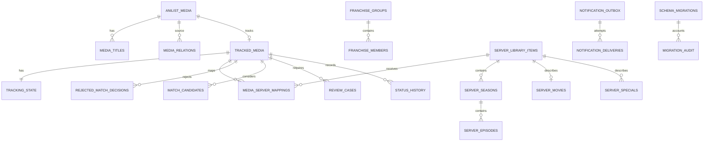

# Modern Database Design

## Scope

Schema version 1 is a migration-validation schema only. The legacy application does not read or write it. The prototype is created under `migration_test`, and production cutover is deferred until Milestone 8. Milestone 2 adds persistence-neutral typed domain objects and does not alter this prototype, so schema version 2 is not needed yet.

## Product Invariants

- AniList identity, tracker workflow, server presence, episode coverage, and review state are independent concepts.
- AniList IDs are stable provider identities. Separate AniList entries are never merged automatically.
- One Jellyfin item may have mappings from multiple AniList entries.
- A mapping can target an entire series, a numbered season, a movie, a special, or remain explicitly unspecified.
- A folder or one episode is insufficient evidence for full season coverage.
- Airing content is `On Server` only when all currently aired episodes are present.
- Finished content is `On Server` only when all expected episodes are present.
- Unknown expected or present counts produce `Unknown Coverage`.
- No match is normal. Review cases exist only for ambiguity, conflict, missing confirmed content, or unresolved identity.
- Removed tracker entries are archived indefinitely by default.
- Manual mappings, path rejections, and title-wide auto-match blocks are durable decisions.
- Private tracker notifications and shared announcements use separate channel purposes and delivery histories.
- Notification delivery is never recorded as successful unless the HTTP attempt succeeds.
- Ordinary settings never contain secrets.
- All Jellyfin discovery remains read-only.

## Schema Diagram

## Identity And Tracking

- `anilist_media` stores provider facts only: format, dates, status, expected episodes, and provider URLs.
- `media_titles` stores English, romaji, native, and synonym variants independently.
- `media_relations` preserves explicit provider edges and related AniList IDs. No relation graph is inferred from title similarity.
- `franchise_groups` and `franchise_members` support confirmed editorial grouping without changing provider identity.
- `tracked_media` represents the user's tracking decision. Removal sets `archived_at`; it does not delete the row.
- `tracking_state` holds workflow, server presence, coverage, review state, and legacy values separately.

## Server Inventory And Coverage

- `server_library_items` represents a filesystem folder or optional Jellyfin API item.
- `server_seasons`, `server_episodes`, `server_movies`, and `server_specials` represent observed content and coverage.
- `jellyfin_folder_mappings` records folder scope independently from AniList mappings.
- `media_server_mappings` permits many AniList entries to target one library item and records optional season scope.
- `episode_mappings` supports explicit provider-to-server episode alignment when numbering differs.
- OVAs, ONAs, and specials may suggest Season 00, but `server_specials.confirmed` remains false until ambiguity is resolved.

## Matching And Review

- `match_candidates` stores scan evidence without changing tracker status.
- `rejected_match_decisions` supports both path-specific rejection and `block_auto_match=1` title-wide decisions.
- `manual_overrides` records deliberate user decisions as typed JSON values rather than overwriting provider facts.
- `review_cases` has an explicit lifecycle and does not treat an ordinary no-match result as review-worthy.
- Missing previously confirmed items open a review case while retaining the historical mapping and path.

## Operations And Notifications

- `scan_sessions` and `anilist_refresh_batches` make partial failures visible.
- `anilist_cache` supports TTL-based refresh and rate-limit-aware batching in Milestone 3.
- `notification_outbox` uses deterministic event keys and atomic state transitions: `PENDING`, `CLAIMED`, `DELIVERED`, or failure states.
- `notification_deliveries` records every HTTP attempt. Failed attempts remain retryable and never imply delivery.
- `channel_purpose` keeps private tracker events separate from shared friend-facing announcements.
- `announcement_baselines` preserves shared-library snapshot semantics.

## Settings, Credentials, And Archives

- `application_settings` rejects secret-bearing rows by schema policy.
- `credential_references` stores only Windows Credential Manager or DPAPI identifiers.
- `archived_legacy_records` preserves malformed, duplicate, deleted-owner, and otherwise uncertain rows as complete legacy payloads.
- `migration_audit` enforces row reconciliation with a table-level check constraint.
- `schema_migrations` provides explicit ordered schema history beginning at version 1.

## Status Vocabulary

Server presence values are `NOT_ON_SERVER`, `PARTIAL`, `ON_SERVER`, `UNKNOWN_COVERAGE`, and `NEEDS_REVIEW`. Episode coverage values are `NONE`, `PARTIAL`, `CURRENT_COMPLETE`, `COMPLETE`, and `UNKNOWN`. A legacy `On Server` row migrates to `UNKNOWN_COVERAGE` until episode evidence is available.

These are schema-v1 migration vocabulary values, not the final domain enum names. Milestone 2 uses `NOT_FOUND`, `PARTIAL`, `COMPLETE`, `UNKNOWN_COVERAGE`, `PATH_MISSING`, and `NOT_APPLICABLE`, with review held independently. A future persistence milestone will migrate schema vocabulary transactionally; Milestone 2 does not rewrite prototype or live data.
